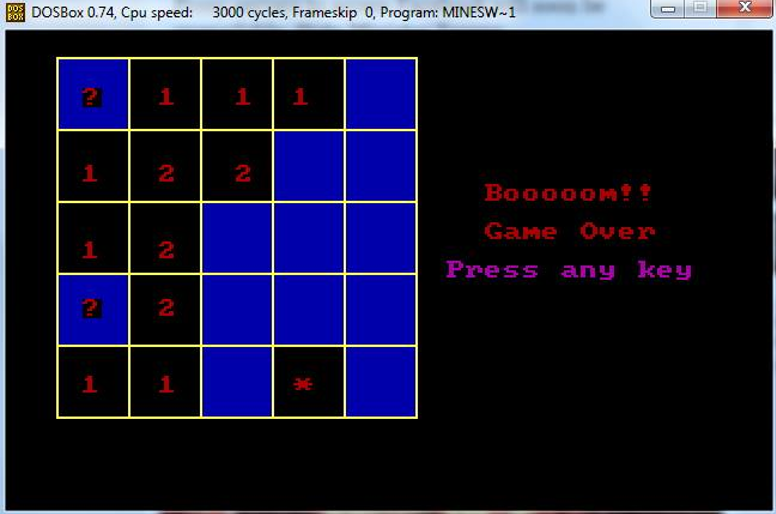

# Minesweeper in Assembly

## Project Overview
This project is an implementation of the classic **Minesweeper** game in **Assembly Language**. The game is developed as part of a microprocessor and assembly language course. The game operates in graphics mode and makes use of several interrupts to handle graphics, mouse input, and game logic.

### Features of the Game
- **Menu System**: 
  - Press `p` to start the game.
  - Press `c` to view credits.
  - Press `esc` to exit the game.
- **Gameplay**:
  - The game is played on a 5x5 board with 5 hidden mines.
  - The numbers `1` and `2` on the board indicate how many neighboring cells contain mines.
  - You can place a flag on a suspected mine by right-clicking, which places a `?` symbol.
  
## How to Play
1. **Objective**: The objective of Minesweeper is to reveal all cells without detonating a mine.
2. **Instructions**: The numbers in the cells indicate how many adjacent cells contain mines.
3. **Game Controls**:
   - Left-click to reveal a cell.
   - Right-click to mark a cell with a flag (`?`).
   - Win by uncovering all cells without hitting a mine.
   - If you uncover a mine, you lose.

## Running the Game
To run this project, you will need a **DOS emulator** (such as **DOSBox**) and a **TASM (Turbo Assembler)** to compile and execute the assembly code.

### Steps to Run:
1. **Install DOSBox**: Download and install [DOSBox](https://www.dosbox.com/).
2. **Install TASM**: Ensure you have TASM installed in the DOSBox environment.
3. **Compile the Code**:
   - Open DOSBox and mount the directory where the project files are located.
   - Use TASM to assemble the `Minesweeper.asm` file:
     ```bash
     tasm Minesweeper.asm
     ```
   - Link the object file:
     ```bash
     tlink Minesweeper.obj
     ```
4. **Run the Game**:
   ```bash
   Minesweeper.exe

## Screenshots

### 1. Menu Screen


### 2. Playing the Game


### 3. Game Over (Hitting a Mine)


### 4. Winning the Game


## Project Team
- **Jargis Ahmed** (Roll 04)
- **Pritom Saha** (Roll 56)

## Limitations
1. Debugging assembly code is difficult and time-consuming.
2. Assembly language is slow to develop in and lacks high-level abstractions.
3. The game board is currently fixed at a 5x5 size; future improvements could include dynamic board sizes.

## Conclusion
This project was a rewarding challenge. Despite the complexity of coding in assembly language and the limitations it imposes, we successfully implemented a working version of Minesweeper. We learned a lot about interrupts, memory management, and game logic in assembly during the process.
